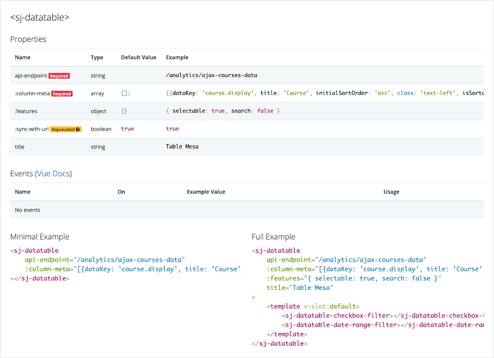

# Vue Documenter
An automatic, living Vue component documenter - yes - a component that documents components, with no build step (ie Webpack or Rollup or extra commands to run, because it's just another component).

# Usage
```
// YourVueDocumentationPage.vue

<template>
	<div>
		// Initially works with Bootstrap 4 classes
		<vue-documenter>
			<some-component></some-component>
			<another-component></another-component>
		</vue-documenter>

		// If you want full width documentation with no table of contents
		<vue-documenter :enable-table-of-contents="false" css-class-components-column="col">
			<some-component></some-component>
			<another-component></another-component>
		</vue-documenter>

		// You can also remap your own (these are defaults)
		<vue-documenter
			css-class-badge-deprecated="badge badge-warning"
			css-class-badge-optional="badge badge-secondary"
			css-class-badge-required="badge badge-danger"
			css-class-card="card card-body"
			css-class-components-column="col-sm-9"
			css-class-components-column-component="card card-body"
			css-class-components-column-component-table-wrapper="table-responsive"
			css-class-components-column-component-table="table table-striped"
			css-class-container="container-fluid"
			css-class-example-minimal="col-sm-6"
			css-class-example-full="col-sm-6"
			css-class-instructions="alert alert-info"
			css-class-table-of-contents-column="col-sm-3"
			css-class-table-of-contents-column-list=""
			css-class-row="row"
		>
			<some-component></some-component>
			<another-component></another-component>
		</vue-documenter>
	</div>
</template>
<script>

	import VueDocumenter from 'vue-documenter';

	import SomeComponent from './components/SomeComponent.vue';
	import AnotherComponent from './components/AnotherComponent.vue';

	export default {
		components: {
			VueDocumenter,
			SomeComponent,
			AnotherComponent,
		},
		data () {
			return {}
		}
	}
</script>

```

# Output


# Why?
For when you don't always have time to keep secondary documentation updated, or aren't able to roll out something like Storybook for everybody on your team.

# Read more
https://medium.com/skilljar-engineering/the-quickest-dirtiest-automatic-est-vue-documenter-ever-cf55845b4df9

# Roadmap
* [Bug] Documentation example code spacing in named slots
* [Feature] Add ability to group components in the documentation
* [Feature] Better usage of slots
* [Done, not yet published] Update events' example value to be code highlighted
* [Done, not yet published] Update documentation table of contents to be sticky
* [Done, not yet published] Update CSS override classes to be individual properties rather than one all-or-nothing overridable object
* [Done, not yet published] Add documentation ~URL~ description field for component meta
* [Done, not yet published] Add description field for prop meta

# Contributing
PRs totally accepted 👍

To run this project locally you'll need a few global packages installed 
* `npm install -g @vue/cli @vue/cli-global-service`

Then get to the `example` directory
* `cd /your-repo-location/vue-documenter/example`

And run it!
* `npm run serve`

This will build the `/your-repo-location/vue-documenter/src/VueDocumenter.vue` and copy the compiled file to the `/your-repo-location/vue-documenter/example/dist/` directory where it'll be referenced correctly by the example `App.vue` entrypoint